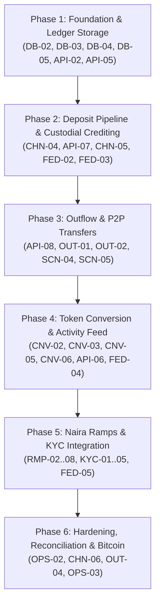

# EngiPay Feature Mapping & Implementation Roadmap

> **Branch**: `drips`  
> **Source Plans**: [`PLAN.md`](PLAN.md), [`README.md`](README.md), [`backend/`](backend/)  
> **Target Ecosystems**: Stellar (Soroban / Horizon / SEP-7 / SEP-23), Base (EVM / EIP-681), Bitcoin (BIP-21 / UTXO)

---

## 1. Executive Summary & Architecture Status

EngiPay is a non-speculative, payment-first crypto platform tailored for Nigeria. It provides:
1. **Naira on-ramp and off-ramp** (NGN to/from USDC, ETH, BTC, XLM).
2. **Scan to pay and receive** (SEP-7, EIP-681, BIP-21, and EngiPay envelopes).
3. **Wallet-to-wallet transfers** on Base, Stellar, and Bitcoin.
4. **Internal account funding, instant zero-fee transfers, and token conversions**.

### Current Working Baseline
- **Frontend**: Next.js App Router, Tailwind CSS, wagmi/RainbowKit for Base, Freighter & WalletConnect for Stellar, QR scanner via `html5-qrcode`, payment URI encoder/decoder (`lib/payment-uri.ts`).
- **Backend Core & Ledger**: Rust workspace, exact `Money` i128 representation, double-entry ledger engine (`engipay-ledger`), append-only PostgreSQL ledger triggers (`0001_ledger.sql`).
- **Chain Service**: Stellar Horizon client, SEP-23 muxed address deposit parser, testnet transaction builder and signer.

---

## 2. Feature Mapping & Breakdown

```
Legend:
[x] Completed / Working
[~] In Progress / Partially Implemented
[ ] Planned / To Be Developed
```

---

### Epic 1: Database Schema & Core Ledger Extensions
**Location**: [`backend/migrations/`](backend/migrations/), [`backend/crates/core/`](backend/crates/core/), [`backend/crates/ledger/`](backend/crates/ledger/)

| Status | ID | Feature / Component | Description & Acceptance Criteria | Target |
| :---: | :---: | :--- | :--- | :--- |
| [x] | `DB-01` | Append-Only Ledger Schema | Table `ledger_transactions`, `ledger_postings`, `ledger_holds`, append-only triggers, zero-sum invariant check, and view `account_balances`. | `migrations/0001_ledger.sql` |
| [ ] | `DB-02` | XLM Asset Support in Database | Update DB constraints in `ledger_postings` and `ledger_holds` to include `'XLM'` alongside `'ETH'`, `'USDC'`, `'BTC'`. | `migrations/0002_add_xlm.sql` |
| [ ] | `DB-03` | Extended Entities Schema | Create schema for `user_profiles`, `deposit_addresses`, `bank_accounts`, `conversions`, `ramp_orders`, and `webhook_events`. | `migrations/0003_entities.sql` |
| [ ] | `DB-04` | SQLx Ledger Store Implementation | Implement production database repository in `engipay-ledger` or `engipay-api` to persist entries via SQLx transactions. | `backend/crates/ledger/` |
| [ ] | `DB-05` | Balance Query & Reservation Service | Query available and held balances per user, place holds for in-flight withdrawals, settle or release holds. | `backend/crates/ledger/` |

---

### Epic 2: API Service & Authentication (`engipay-api`)
**Location**: [`backend/crates/api/`](backend/crates/api/)

| Status | ID | Feature / Component | Description & Acceptance Criteria | Target |
| :---: | :---: | :--- | :--- | :--- |
| [x] | `API-01` | Server Skeleton & Health | Axum server on Tokio, graceful shutdown, `/healthz` and `/v1/assets` endpoints. | `crates/api/src/routes/` |
| [ ] | `API-02` | SIWE (Sign-In with Ethereum) | Issue nonce (`POST /v1/auth/nonce`), verify EIP-4361 signature, issue session JWT. | `crates/api/src/routes/auth.rs` |
| [ ] | `API-03` | SIWS (Sign-In with Stellar) | SEP-10 challenge transaction generation and signature verification for Stellar accounts. | `crates/api/src/routes/auth.rs` |
| [ ] | `API-04` | User Profile & Limits (`/me`) | Endpoint for user profile, verification status, tier-based daily/single limits. | `crates/api/src/routes/me.rs` |
| [ ] | `API-05` | Balances Endpoint | `GET /v1/balances`: Returns available and held balances across all 4 assets (USDC, XLM, ETH, BTC). | `crates/api/src/routes/balances.rs` |
| [ ] | `API-06` | Unified Activity / History | `GET /v1/transactions`: Paginated unified ledger feed (deposits, transfers, withdrawals, swaps, ramps). | `crates/api/src/routes/transactions.rs` |
| [ ] | `API-07` | Deposit Address Provisioning | `GET /v1/deposit-address?chain=stellar\|base\|bitcoin`: Return existing address or generate new address. | `crates/api/src/routes/deposits.rs` |
| [ ] | `API-08` | Internal Transfers Endpoint | `POST /v1/transfers`: Instant P2P transfer between two EngiPay users with atomic balance debit/credit. | `crates/api/src/routes/transfers.rs` |
| [ ] | `API-09` | Payment Requests Endpoint | `POST /v1/payment-requests` & `GET /v1/payment-requests/:id`: Create/query invoice with standard URI + QR. | `crates/api/src/routes/requests.rs` |

---

### Epic 3: Multi-Chain Custody & Deposits (`engipay-chain`)
**Location**: [`backend/crates/chain/`](backend/crates/chain/)

| Status | ID | Feature / Component | Description & Acceptance Criteria | Target |
| :---: | :---: | :--- | :--- | :--- |
| [x] | `CHN-01` | Chain Client Abstraction | `ChainClient` trait with `latest_height`, `deposits_since`, and `required_confirmations`. | `crates/chain/src/lib.rs` |
| [x] | `CHN-02` | Stellar Deposit Ingestion (Horizon) | Watch payments to custody account, filter by valid muxed ID, verify Circle USDC issuer, 1 ledger finality. | `crates/chain/src/stellar/` |
| [x] | `CHN-03` | Stellar Payment Builder & Signer | Build payments using `stellar-xdr` and sign with testnet key / KMS. | `crates/chain/src/stellar/payment.rs` |
| [ ] | `CHN-04` | Stellar Deposit-to-Ledger Bridge | Link chain watcher output to API database to credit user accounts with idempotency reference. | `crates/chain/src/watcher.rs` |
| [ ] | `CHN-05` | Base / EVM Deposit Ingestion | Watch Base blocks via RPC (`alloy`), track native ETH and ERC-20 USDC transfers, wait 12 confirmations. | `crates/chain/src/evm/` |
| [ ] | `CHN-06` | Bitcoin Deposit Ingestion | Watch Bitcoin transactions via RPC / indexer (`bdk`), track native BTC deposits, wait 2 confirmations. | `crates/chain/src/bitcoin/` |
| [ ] | `CHN-07` | Chain Service Internal IPC / RPC | Provide internal HTTP/gRPC service for API to call: `create_wallet`, `send`, `estimate_fee`, `get_tx`. | `crates/chain/src/server.rs` |
| [ ] | `CHN-08` | Secure Key Management (KMS / HSM) | Abstraction for cloud KMS (AWS/GCP/Vault) so private keys never exist in plaintext files or API memory. | `crates/chain/src/keystore.rs` |

---

### Epic 4: On-Chain Outflow & Withdrawals
**Location**: [`backend/crates/api/`](backend/crates/api/), [`backend/crates/chain/`](backend/crates/chain/)

| Status | ID | Feature / Component | Description & Acceptance Criteria | Target |
| :---: | :---: | :--- | :--- | :--- |
| [ ] | `OUT-01` | Withdrawal Request API | `POST /v1/withdrawals`: Validate balance, create hold on user funds, queue withdrawal job. | `crates/api/src/routes/withdrawals.rs` |
| [ ] | `OUT-02` | Stellar Withdrawal Execution | Build and broadcast payment to recipient `G...` or `M...` address; on confirmation settle hold; on failure release hold. | `crates/chain/src/stellar/` |
| [ ] | `OUT-03` | Base / EVM Withdrawal Execution | Build, sign, and broadcast ETH/USDC transaction via `alloy`; handle gas price and nonce synchronization. | `crates/chain/src/evm/` |
| [ ] | `OUT-04` | Bitcoin Withdrawal Execution | Construct UTXO transaction with change address, sign via `bdk`, broadcast, and track confirmations. | `crates/chain/src/bitcoin/` |
| [ ] | `OUT-05` | Withdrawal Safeguards | Cooling-off period for new recipient addresses; secondary approval threshold; rate limits. | `crates/api/src/services/safety.rs` |

---

### Epic 5: In-App Token Conversion (Swaps)
**Location**: [`backend/crates/api/`](backend/crates/api/), [`app/(app)/convert/`](app/(app)/convert/)

| Status | ID | Feature / Component | Description & Acceptance Criteria | Target |
| :---: | :---: | :--- | :--- | :--- |
| [x] | `CNV-01` | Conversion UI Layout | Frontend screen at `/convert` with asset pickers, amount inputs, and disabled state message. | `app/(app)/convert/page.tsx` |
| [ ] | `CNV-02` | Price Feed & Quote Engine | `POST /v1/convert/quote`: Ingest real-time DEX/CEX rates, add configurable spread, return time-limited quote. | `crates/api/src/routes/convert.rs` |
| [ ] | `CNV-03` | Same-Chain Swap Execution | Integrate Base DEX aggregator (e.g. 0x / Uniswap) to execute USDC <-> ETH conversions. | `crates/chain/src/swaps/` |
| [ ] | `CNV-04` | Cross-Chain Liquidity Routing | Backend liquidity rebalancing or swap partner for BTC <-> USDC / XLM <-> USDC. | `crates/api/src/services/` |
| [ ] | `CNV-05` | Atomic Conversion Ledger Settlement | Order state machine: hold source asset -> execute swap -> credit target asset & debit hold atomically. | `crates/api/src/services/conversion.rs` |
| [ ] | `CNV-06` | Live Frontend Conversion Flow | Replace placeholder with live quotes, 60s countdown bar, slippage warning, and instant confirmation. | `components/convert/` |

---

### Epic 6: Nigerian Naira (NGN) On-Ramp & Off-Ramp
**Location**: [`backend/crates/api/`](backend/crates/api/), [`app/(app)/buy/`](app/(app)/buy/), [`app/(app)/sell/`](app/(app)/sell/)

| Status | ID | Feature / Component | Description & Acceptance Criteria | Target |
| :---: | :---: | :--- | :--- | :--- |
| [x] | `RMP-01` | Buy & Sell UI Layouts | Modern screens at `/buy` and `/sell` with asset selection, NGN conversion display, disabled stub messages. | `app/(app)/buy/`, `sell/` |
| [ ] | `RMP-02` | Ramp Partner Adapter Interface | Common Rust trait for partner integrations (Yellow Card, Onramp.money, LINK.IO / NGNC, cNGN). | `crates/api/src/ramp/` |
| [ ] | `RMP-03` | NGN Ramp Quoting | `POST /v1/ramp/quote`: Fetch FX exchange rates (NGN/USD/Crypto), apply platform fee, return quote with expiry. | `crates/api/src/routes/ramp.rs` |
| [ ] | `RMP-04` | On-Ramp Order Flow (Buy Crypto) | `POST /v1/ramp/orders`: Initiate buy, return bank transfer or payment instructions; handle user completion. | `crates/api/src/routes/ramp.rs` |
| [ ] | `RMP-05` | Off-Ramp Order Flow (Sell Crypto) | `POST /v1/ramp/orders`: Place hold on crypto balance, trigger NGN bank payout to verified account. | `crates/api/src/routes/ramp.rs` |
| [ ] | `RMP-06` | Webhook Receiver & Verification | `POST /v1/ramp/webhook`: Verify partner cryptographic signature, deduplicate in `webhook_events`, settle orders. | `crates/api/src/routes/ramp.rs` |
| [ ] | `RMP-07` | Nigerian Bank Account Verification | Verify bank code, NUBAN account number, and match account holder name against KYC records. | `crates/api/src/routes/bank.rs` |
| [ ] | `RMP-08` | Frontend Ramp Experience | Interactive on-ramp and off-ramp flow with real-time status tracker, bank details selector, and receipt view. | `components/ramp/` |

---

### Epic 7: KYC, Identity & Compliance
**Location**: [`backend/crates/api/`](backend/crates/api/), [`app/(app)/settings/`](app/(app)/settings/)

| Status | ID | Feature / Component | Description & Acceptance Criteria | Target |
| :---: | :---: | :--- | :--- | :--- |
| [ ] | `KYC-01` | Tiered Verification Model | Tier 0 (low limit, wallet only), Tier 1 (BVN/NIN verified), Tier 2 (ID + liveness), Tier 3 (address proof). | `crates/api/src/kyc/` |
| [ ] | `KYC-02` | Identity Provider Integration | Integrate Nigerian identity verification service (Dojah or Smile ID) via secure HTTP client. | `crates/api/src/kyc/provider.rs` |
| [ ] | `KYC-03` | KYC Session API | `POST /v1/kyc/session`: Start verification flow, handle webhooks or instant BVN validation. | `crates/api/src/routes/kyc.rs` |
| [ ] | `KYC-04` | Sanction & AML Screening | Check deposit and withdrawal addresses against known sanctions / threat intelligence lists. | `crates/api/src/services/aml.rs` |
| [ ] | `KYC-05` | User Settings KYC Interface | Settings tab showing current tier, transaction limits, verification status, and upgrade buttons. | `app/(app)/settings/page.tsx` |

---

### Epic 8: Scan, Pay & Mobile Payment Experience
**Location**: [`app/(app)/scan/`](app/(app)/scan/), [`app/(app)/receive/`](app/(app)/receive/), [`lib/payment-uri.ts`](lib/payment-uri.ts)

| Status | ID | Feature / Component | Description & Acceptance Criteria | Target |
| :---: | :---: | :--- | :--- | :--- |
| [x] | `SCN-01` | Camera QR Scanner | Real camera scanner using `html5-qrcode` in `/scan`. | `components/payments/QRScanner.tsx` |
| [x] | `SCN-02` | Multi-Format URI Parser | Full parser & serializer for EIP-681, BIP-21, SEP-7, and JSON `engipay.request`. | `lib/payment-uri.ts` |
| [x] | `SCN-03` | Standard Receive Codes | Generate QR codes on Base and Stellar with selectable asset and amount. | `app/(app)/receive/page.tsx` |
| [ ] | `SCN-04` | Intelligent Payment Routing | When scanning: detect if address belongs to an EngiPay user -> trigger instant internal transfer; else prompt on-chain send. | `app/(app)/send/page.tsx` |
| [ ] | `SCN-05` | Dual Payment Source Selector | Allow users on `/send` to choose paying from "Connected Wallet" (Freighter/MetaMask) or "EngiPay Balance". | `components/payments/SendPayment.tsx` |

---

### Epic 9: Frontend App Integration & Backend API Client
**Location**: [`app/`](app/), [`lib/`](lib/), [`hooks/`](hooks/)

| Status | ID | Feature / Component | Description & Acceptance Criteria | Target |
| :---: | :---: | :--- | :--- | :--- |
| [x] | `FED-01` | App Shell & Wallet Navigation | App navigation, responsive layout, connect wallet sheet (EVM & Stellar), network indicator. | `app/(app)/layout.tsx` |
| [ ] | `FED-02` | EngiPay Backend API Client | Strongly typed API client library for frontend to communicate with Axum backend. | `lib/api-client.ts` |
| [ ] | `FED-03` | Live Dashboard Balances | Connect Dashboard to `GET /v1/balances` to show custodial balance alongside connected wallet balances. | `app/(app)/dashboard/` |
| [ ] | `FED-04` | Unified Activity Feed Component | Replace empty activity screen with infinite scrolling list from `GET /v1/transactions`. | `app/(app)/activity/` |
| [ ] | `FED-05` | Bank Account Management UI | Add/remove verified Nigerian bank accounts in `/settings`. | `app/(app)/settings/` |

---

### Epic 10: Operational Hardening, Treasury & Drips Wave Readiness
**Location**: Workspace-wide

| Status | ID | Feature / Component | Description & Acceptance Criteria | Target |
| :---: | :---: | :--- | :--- | :--- |
| [x] | `OPS-01` | Security Guardrails & CI | Pre-commit hooks, CI checks for clippy, cargo test, database guarantees, and TypeScript compilation. | `.github/workflows/ci.yml` |
| [ ] | `OPS-02` | Daily Ledger-to-Chain Reconciliation | Automated reconciliation job comparing total on-chain custody balances against ledger liabilities. | `backend/crates/reconciliation/` |
| [ ] | `OPS-03` | Cold Storage Threshold Sweeper | Automated alert or sweeping mechanism when hot wallet balances exceed operational thresholds. | `backend/crates/chain/` |
| [ ] | `OPS-04` | Drips Stellar Wave Submission | Issue tracking, milestone labeling, and application readiness for Drips Wave funding. | GitHub Project & Issues |

---

## 3. Implementation Phases & Recommended Execution Order



### Phase 1: Foundation & Ledger Storage (Current Focus)
1. Add migration `0002_add_xlm.sql` for XLM support in Postgres ledger checks.
2. Add migration `0003_entities.sql` for users, bank accounts, deposit addresses, orders, and webhook events.
3. Build SQLx ledger repository in backend to execute credits, debits, holds, releases, and balance calculations.
4. Implement `GET /v1/balances` and user session authentication.

### Phase 2: Deposit Pipeline & Custodial Crediting
1. Connect `engipay-chain`'s Stellar Horizon watcher to the ledger store so incoming XLM/USDC deposits credit user balances.
2. Expose `GET /v1/deposit-address` for users to view their muxed Stellar deposit address.
3. Connect frontend Dashboard to display live custodial balances from the backend.

### Phase 3: Outflow & P2P Transfers
1. Build internal EngiPay-to-EngiPay transfer endpoint (`POST /v1/transfers`) with zero fees.
2. Implement Stellar withdrawal execution (`POST /v1/withdrawals`) with ledger hold -> broadcast -> settle.
3. Update `/send` UI to support choosing payment source (Wallet vs EngiPay Balance) and route internal transfers.

### Phase 4: Token Conversion & Activity
1. Implement quote engine and order execution for token swaps.
2. Wire frontend `/convert` with live quotes and execution flow.
3. Implement `/v1/transactions` unified history and connect `/activity` screen.

### Phase 5: Naira Ramps & KYC Integration
1. Implement KYC tier verification with Nigerian provider (Dojah / Smile ID).
2. Implement NGN Ramp adapter, quoting, bank account verification, and webhook handling.
3. Wire `/buy` and `/sell` screens to live ramp endpoints.

### Phase 6: Hardening, Reconciliation & Bitcoin
1. Implement automated daily chain-vs-ledger reconciliation worker.
2. Build Base EVM and Bitcoin deposit/withdrawal clients.
3. Deploy cold storage sweeping rules and operational monitoring.
