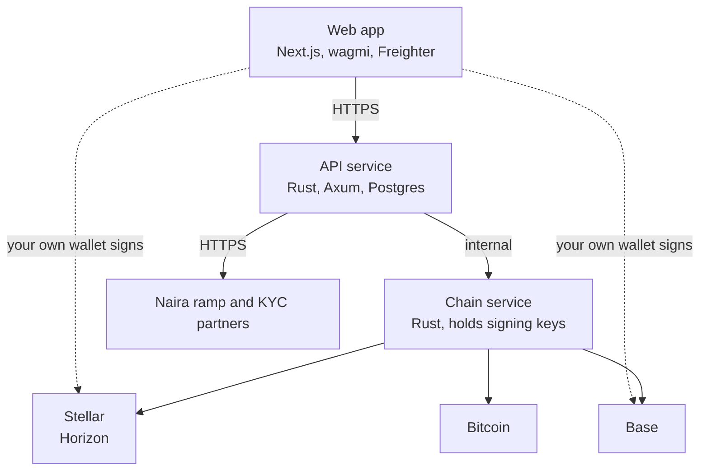

<div align="center">


# EngiPay

**Pay and get paid in crypto from Nigeria.** Scan a code to pay, send to any wallet, and move between crypto and Naira, on Stellar, Base and Bitcoin.

[](https://github.com/The-Engineer-Network/engipay/actions/workflows/ci.yml)
[](LICENSE)

</div>

---

## Why EngiPay

Sending money into, out of and around Nigeria is slow and expensive, and most crypto apps are built for traders rather than for people paying each other. EngiPay is a payments app first. It does four things and nothing else:

| Feature | What it means |
| --- | --- |
| **Naira on and off ramp** | Buy USDC, XLM, ETH or BTC with Naira, and cash out to a Nigerian bank account. |
| **Scan to pay and receive** | Show a QR code to get paid. Scan one to pay. Codes follow open standards, so they work with other wallets too. |
| **Wallet to wallet transfers** | Send to any address on Stellar, Base or Bitcoin, from your own wallet or your EngiPay balance. |
| **Fund, send and convert** | Move funds into EngiPay, pay anyone, convert between assets, and withdraw at any time. |

No lending, staking or yield. The full product and technical plan is in [PLAN.md](PLAN.md).

## Why Stellar

Stellar was built for exactly this: payments that settle in about five seconds for a fraction of a cent, a native USDC issued by Circle, and regulated on and off ramps (anchors) for local currencies. EngiPay uses it as a first-class payment network:

- **Scan to pay with SEP-7.** Receive codes are `web+stellar:pay` URIs, so any Stellar wallet can pay an EngiPay code, and EngiPay can pay theirs, memos included.
- **Muxed deposit addresses (SEP-23).** Each user gets their own `M...` address on a single custody account, so deposits are credited to the right person without relying on a memo.
- **Checked before signing.** Addresses are validated with the strkey checksum, secret keys pasted by mistake are refused by name, and USDC is only accepted from Circle's own issuer.
- **Keys stay in the wallet.** In the web app, payments are signed in [Freighter](https://www.freighter.app/). EngiPay builds the transaction and never sees the key.

## What works today

EngiPay is in active development on testnet. This table is kept honest: nothing is listed as working until it is.

| Area | Status |
| --- | --- |
| Connect an EVM wallet (MetaMask, Coinbase, Trust, WalletConnect and more) | Working |
| Connect Freighter for Stellar | Working |
| Send ETH and USDC on Base | Working, from your own wallet |
| Send XLM and USDC on Stellar, with memos and new-account creation | Working, from your own wallet |
| Receive codes for Base (EIP-681) and Stellar (SEP-7) | Working |
| Scanner for EngiPay, EIP-681, BIP-21 and SEP-7 codes | Working |
| Backend: exact money types, double-entry ledger, Postgres guarantees | Working, tested |
| Chain service: Stellar deposit watching and payment signing | Working on testnet, not yet crediting the database ledger |
| EngiPay balances, internal transfers, conversion | In progress |
| Naira ramps and identity checks | Planned: partner not yet chosen |
| Bitcoin sending | Planned |

## Architecture



The chain service is a separate binary because it is the only process that will ever hold keys. Compromising the API must not give anyone the ability to move funds.

```
engipay/
├── app/                   Next.js routes: landing, dashboard, send, receive, scan, convert, buy, sell
├── components/            UI, wallet sheet, payment forms
├── contexts/              EVM wallet (wagmi) and Stellar wallet (Freighter)
├── lib/                   payment codes, Stellar and Base helpers (with tests)
└── backend/               Rust workspace
    ├── crates/core/       assets, exact money, Stellar addresses
    ├── crates/ledger/     double-entry ledger rules
    ├── crates/api/        HTTP API (engipay-api)
    ├── crates/chain/      chain service (engipay-chain), Stellar client
    └── migrations/        Postgres schema with append-only ledger guarantees
```

## Getting started

### Web app

Requires Node.js 20.9 or newer.

```bash
git clone https://github.com/The-Engineer-Network/engipay.git
cd engipay
npm ci --ignore-scripts
cp .env.example .env.local
npm run dev
```

Open http://localhost:3000.

### Try a Stellar payment on testnet

1. Install [Freighter](https://www.freighter.app/) and switch it to **Testnet**.
2. Fund your testnet account with free test XLM from [Friendbot](https://lab.stellar.org/account/fund).
3. In EngiPay, choose **Connect wallet**, then **Freighter** under Stellar.
4. Open **Send**, pick **Stellar Testnet**, and pay any `G...` or `M...` address. Or open **Receive** on one device and **Scan** on another.

### Backend

The backend builds and runs in Docker, so nothing is compiled on your machine.

```bash
cd backend
cp .env.example .env              # set POSTGRES_PASSWORD to a long random value
docker compose up -d postgres api
curl http://127.0.0.1:8080/healthz
curl http://127.0.0.1:8080/v1/assets
```

Watch Stellar testnet deposits into a custody account:

```bash
docker compose run --rm -e STELLAR_CUSTODY_ACCOUNT=G... toolbox cargo run -p engipay-chain
```

## Testing

| What | Command |
| --- | --- |
| Web app type check | `npm run typecheck` |
| Payment code tests | `npm test` |
| Production build | `npm run build` |
| Backend tests | `cd backend && docker compose run --rm toolbox cargo test` |
| Backend lint | `cd backend && docker compose run --rm toolbox cargo clippy --all-targets -- -D warnings` |
| Ledger guarantees in Postgres | `cd backend && docker compose up -d postgres && ./scripts/test-db-guarantees.sh` |

CI runs all of these on every pull request.

## Security

EngiPay handles money, so the rules are strict and written down: exact integer money with no floating point, a ledger the database refuses to modify, keys only in the chain service, and no secrets in the repository. Dependency install scripts are never run in CI.

Found a vulnerability? Please report it privately. See [SECURITY.md](SECURITY.md).

## Contributing

Contributions are welcome, from typo fixes to Stellar features. Start with [CONTRIBUTING.md](CONTRIBUTING.md), then pick an issue labelled `good first issue`.

## License

[Apache License 2.0](LICENSE).
